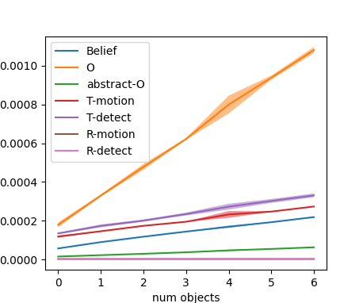
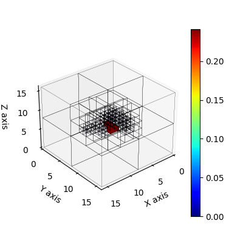
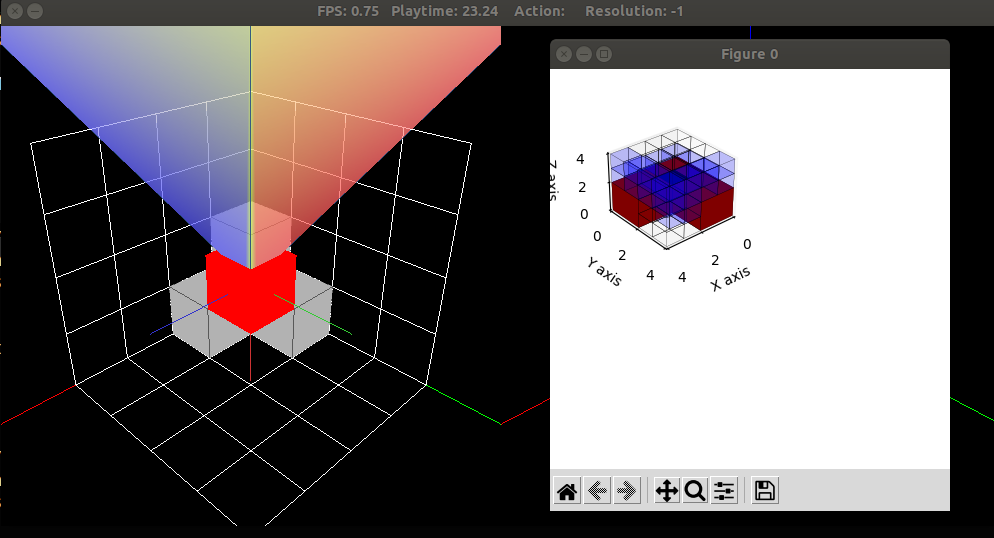

# [3D-MOS](https://arxiv.org/abs/2005.02878)

This is our implementation of the 3D Multi-Object Search (3D-MOS) domain modeled
as a POMDP as well as the Multi-Resolution POUCT planning algorithm proposed in our paper
[**Multi-Resolution POMDP Planning for Multi-Object Search in
3D**](https://kaiyuzheng.me/documents/papers/iros21-3dmos.pdf) (IROS 2021).
**IROS RobotCup Best Paper Award**.

* **Website**: [https://zkytony.github.io/3D-MOS/](https://zkytony.github.io/3D-MOS/)
<!-- #<># -->

* **Robot Demo**: [https://www.youtube.com/watch?v=oo-wrL0ta6k](https://www.youtube.com/watch?v=oo-wrL0ta6k)
<!-- #<># -->

* **Talk**: [https://www.youtube.com/watch?v=5G09TRepJLY](https://www.youtube.com/watch?v=5G09TRepJLY&feature=emb_title&ab_channel=KaiyuZheng)

* **PDF**: [https://arxiv.org/pdf/2005.02878.pdf](https://arxiv.org/pdf/2005.02878.pdf)
<!-- #<># -->


Robots operating in households must find objects on shelves, under tables, and in cupboards. In such environments, it is crucial to search efficiently at 3D scale while coping with limited field of view and the complexity of searching for multiple objects. Principled approaches to object search frequently use Partially Observable Markov Decision Process (POMDP) as the underlying framework for computing search strategies, _but constrain the search space in 2D_. In this paper, we present a **POMDP formulation for multi-object search in a 3D region with a frustum-shaped field-of-view.** To efficiently solve this POMDP, we propose a **multi-resolution planning algorithm** based on online Monte-Carlo tree search. In this approach, we design a novel **octree-based belief representation** to capture uncertainty of the target objects at different resolution levels, then derive abstract POMDPs at lower resolutions with dramatically smaller state and observation spaces. Evaluation in a simulated 3D domain shows that our approach finds objects more efficiently and successfully compared to a set of baselines without resolution hierarchy in larger instances under the same computational requirement. We demonstrate our approach on a mobile robot to find objects placed at different heights in two 10m2×2m regions by moving its base and actuating its torso.


## Installation <a name="installation"/>

The required python version is Python 3.6+.

1. Clone the repository and create and virtual environment with the following lines.

    ```
    git clone git@github.com:zkytony/3D-MOS.git
    cd 3D-MOS;
    virtualenv -p python3 venv/mos3d
    source venv/mos3d/bin/activate
    ```

2. Install [pomdp-py](https://github.com/h2r/pomdp-py)

    ```
    pip install pomdp-py==1.2.4.5
    ```

    (Future `pomdp-py` versions are expected to be applicable too.)

3. Install the `mos3d` package. Assume you're at the root of the repository.

    ```
    pip install -e .
    ```

### System requirements
We have only worked on this project using Ubuntu 16.04 and 18.04. It is likely working on 20.04.
It may or may not work on Windows or Mac. Because the simulator uses [PyOpenGL](http://pyopengl.sourceforge.net/),
the system is expected to have OpenGL available. The version we last tested on is:
```
$ glxinfo | grep "OpenGL version"
OpenGL version string: 4.6.0 NVIDIA 465.19.01
```
If you are using Ubuntu on a desktop computer, then you will most likely have OpenGL.

## Test

There are four tests you can run.

```
cd tests/
python test_models.py
python test_octree_belief.py
python test_sensor.py
python test_abstraction.py
```

### Expected output: test_models.py

```
$ python test_models.py
pygame 2.0.1 (SDL 2.0.14, Python 3.8.10)
Hello from the pygame community. https://www.pygame.org/contribute.html
**N OBJ: 1 **
[10/10]
[10/10]
[10/10]
[10/10]
[10/10]
**N OBJ: 2 **
[10/10]
[10/10]
...
**N OBJ: 7 **
[10/10]
[10/10]
[10/10]
[10/10]
[10/10]
```
Then a plot will be shown that looks similar to:



If there is a warning about "Gimbal lock", please ignore it.


### Expected output: test_octree_belief.py

```
$ python test_octree_belief.py
pygame 2.0.1 (SDL 2.0.14, Python 3.8.10)
Hello from the pygame community. https://www.pygame.org/contribute.html
** Testing Basics
0.000244140625
0.001953125
0.015625
0.125
1.0
0.9606609347230894
...
** Testing belief update
orange_ricky(3, 2, 3)
0.08877840909090909
Observation({(2, 0, 2): (2, 0, 2, free), (0, 1, 0): (0, 1, 0, unknown), .... # a huge list
orange_ricky(2, 1, 0)
0.24153830881598135
Avg sample time (res=1): 0.099
Avg sample time (res=2): 0.062
Avg sample time (res=4): 0.039
```
Two plots will be shown along the way that look like:





### Expected output: test_sensor.py
```
$ python test_sensor.py
pygame 2.0.1 (SDL 2.0.14, Python 3.8.10)
Hello from the pygame community. https://www.pygame.org/contribute.html
Passed.
1.5707963267948966
2.00, 2.00
20.00, 20.00
When depth=4, field of view volume contains 19 voxels
When depth=5, field of view volume contains 44 voxels
When depth=6, field of view volume contains 69 voxels
When depth=7, field of view volume contains 118 voxels
...
World 4x4x4:
    In a world of dimensions 4x4x4, d=4 takes up 0.172
    In a world of dimensions 4x4x4, d=5 takes up 0.312
    In a world of dimensions 4x4x4, d=6 takes up 0.703
...
World 8x8x8:
    In a world of dimensions 8x8x8, d=4 takes up 0.021
  **** recommended setting (2\%) for 8x8x8: 4 ****
    In a world of dimensions 8x8x8, d=5 takes up 0.039
    In a world of dimensions 8x8x8, d=6 takes up 0.088
...
# up to 128x128x128
```

### Expected output: test_abstraction.py

This is basically an example for running plannings in simulated 3D grid worlds.

The test contains several trials:
```
# under __main__
    test_planner(worldocc_small, "flat", "state_action_abstraction")
    test_planner(worldocc_small, "multires", "state_action_abstraction")
    test_planner(worldocc, "multires", "state_action_abstraction")
    test_planner(world32, "multires", "state_action_abstraction")
    test_planner(random_worldstr, "multires", "state_action_abstraction")
```
Here, `worldocc_small`, `world_occ`, `world32`, `random_worldstr` are string specifications
of the 3D grid world. `multires` or `flat` are the planning algorithms, and `state_action_abstraction`
is the type of test to perform.

The following shows a visualization with a randomly generated 8x8x8 world:

   

The following shows a visualization with a 4x4x4 world with an occluded target object (behind the gray obstacles):

   


## Experiment Results

You can download the experiment results here:

* [Scalability.zip](https://drive.google.com/file/d/1ObA8AWkGGQ9OlBpeAjwnB_m_iQ96GZ9K/view?usp=sharing) (1.18GB)
* [Quality.zip](https://drive.google.com/file/d/1CGrUrSooIho8ZFZayC4G5uPFnbmH4mm_/view?usp=sharing) (170.9MB)

After download, unzip each so that the output directory is placed under `mos3d/experiments/results`.

Each zip file contains a collection of trials for the experiment.

The folder for each trial
contains files including:

* config.yaml: Configuration for that trial
* log.txt: Readable log of trial execution
* history.pkl: A sequence of (action, observation) pairs experienced by the agent in that trial
* states.pkl: A sequence of states of the environment
* rewards.yaml: reward obtained at each step
* trial.pkl: an object that inherits `sciex.Trial` which was used for running the trial.

You can replay a trial using the `replay.py` script. To do this,
you need to first install [`sciex`](https://github.com/zkytony/sciex):
```
pip install sciex==0.2
```
Then,
```
$ cd mos3d/experiments
$ python replay.py
pygame 2.0.1 (SDL 2.0.14, Python 3.8.10)
Hello from the pygame community. https://www.pygame.org/contribute.html
Quality [q] or Scalability [s]? s
...
[3650] domain(8-6-6-10-3.0-500-240)_943414_purelyrandom-octree-uniform
[3651] domain(8-6-6-10-3.0-500-240)_959799_bruteforce-octree-uniform
[3652] domain(8-6-6-10-3.0-500-240)_959799_hierarchical-octree-uniform
[3653] domain(8-6-6-10-3.0-500-240)_959799_options-octree-uniform
[3654] domain(8-6-6-10-3.0-500-240)_959799_pomcp-particles-uniform
[3655] domain(8-6-6-10-3.0-500-240)_959799_porollout-octree-uniform
[3656] domain(8-6-6-10-3.0-500-240)_959799_pouct-octree-uniform
[3657] domain(8-6-6-10-3.0-500-240)_959799_purelyrandom-octree-uniform
Which trial [1-3657] ? 3652
```
Then the trial 3652 will replay and you will see a visualization of the environment.
Replay a different trial by entering the corresponding index.

### Hardware Spec
When conducting the experiments, we equally divided the trials to be completed
on four computers in our lab with Intel i7 CPUs.
```
Intel(R) Core(TM) i7-9700K CPU @ 3.60GHz
Intel(R) Core(TM) i7-5930K CPU @ 3.50GHz
Intel(R) Core(TM) i7-5930K CPU @ 3.50GHz
Intel(R) Core(TM) i7-8700 CPU @ 3.20GHz
```

## Citation
If you find 3D-MOS helpful to your research, please consider citing the following paper:
```
@inproceedings{zheng2020multi,
  title={Multi-Resolution {POMDP} Planning for Multi-Object Search in {3D}},
  booktitle={IEEE/RSJ International Conference on Intelligent Robots and Systems (IROS)},
  author={Zheng, Kaiyu and Sung, Yoonchang and Konidaris, George and Tellex, Stefanie},
  year={2021}
}
```

## People

* [Kaiyu Zheng](https://kaiyuzheng.me/) (Brown University)
* [Yoonchang Sung](https://yoonchangsung.com/) (MIT CSAIL)
* [George Konidaris](https://cs.brown.edu/people/gdk/) (Brown University)
* [Stefanie Tellex](https://h2r.cs.brown.edu/people/) (Brown University)
