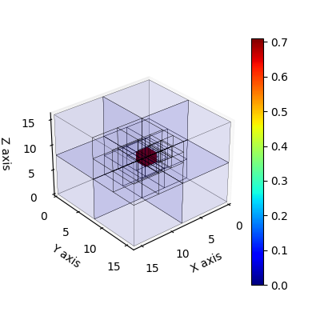
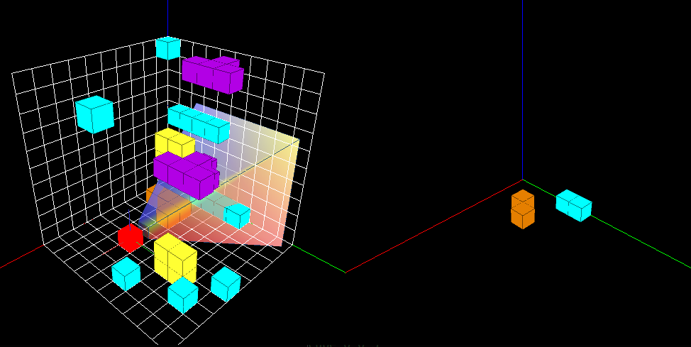

# 3D-MOS

This is our implementation of the 3D-MOS POMDP domain as well
as the Multi-Resolution POUCT planning algorithm in the paper
[Multi-Resolution POMDP Planning for Multi-Object Search in 3D](https://kaiyuzheng.me/documents/papers/iros21-3dmos.pdf) (IROS 2021).


## Installation <a name="installation"/>

The required python version is Python 3.6+.

1. Clone the repository and create and virtual environment with the following lines.

    ```
    git clone git@github.com:zkytony/3D-MOS.git
    cd 3D-MOS;
    virtualenv -p python3 venv/mos3d
    source venv/mos3d/bin/activate
    ```

2. Install [pomdp-py](https://github.com/h2r/pomdp-py)

    ```
    pip install pomdp-py==1.2.4.5
    ```

    (Future `pomdp-py` versions are expected to be applicable too.)

3. Install the `mos3d` package. Assume you're at the root of the repository.

    ```
    pip install -e .
    ```

## Test

There are four tests you can run.

```
cd tests/
python test_models.py
python test_octree_belief.py
python test_sensor.py
python test_abstraction.py
```

### Expected output: test_models.py

```
$ python test_models.py
pygame 2.0.1 (SDL 2.0.14, Python 3.8.10)
Hello from the pygame community. https://www.pygame.org/contribute.html
**N OBJ: 1 **
[10/10]
[10/10]
[10/10]
[10/10]
[10/10]
**N OBJ: 2 **
[10/10]
[10/10]
...
**N OBJ: 7 **
[10/10]
[10/10]
[10/10]
[10/10]
[10/10]
```
Then a plot will be shown that looks similar to:


If there is a warning about "Gimbal lock", please ignore it.


### Expected output: test_octree_belief.py

```
$ python test_octree_belief.py
pygame 2.0.1 (SDL 2.0.14, Python 3.8.10)
Hello from the pygame community. https://www.pygame.org/contribute.html
** Testing Basics
0.000244140625
0.001953125
0.015625
0.125
1.0
0.9606609347230894
...
** Testing belief update
orange_ricky(3, 2, 3)
0.08877840909090909
Observation({(2, 0, 2): (2, 0, 2, free), (0, 1, 0): (0, 1, 0, unknown), .... # a huge list
orange_ricky(2, 1, 0)
0.24153830881598135
Avg sample time (res=1): 0.099
Avg sample time (res=2): 0.062
Avg sample time (res=4): 0.039
```
Two plots will be shown along the way that look like:




### Expected output: test_sensor.py
```
$ python test_sensor.py
pygame 2.0.1 (SDL 2.0.14, Python 3.8.10)
Hello from the pygame community. https://www.pygame.org/contribute.html
Passed.
1.5707963267948966
2.00, 2.00
20.00, 20.00
When depth=4, field of view volume contains 19 voxels
When depth=5, field of view volume contains 44 voxels
When depth=6, field of view volume contains 69 voxels
When depth=7, field of view volume contains 118 voxels
...
World 4x4x4:
    In a world of dimensions 4x4x4, d=4 takes up 0.172
    In a world of dimensions 4x4x4, d=5 takes up 0.312
    In a world of dimensions 4x4x4, d=6 takes up 0.703
...
World 8x8x8:
    In a world of dimensions 8x8x8, d=4 takes up 0.021
  **** recommended setting (2\%) for 8x8x8: 4 ****
    In a world of dimensions 8x8x8, d=5 takes up 0.039
    In a world of dimensions 8x8x8, d=6 takes up 0.088
...
# up to 128x128x128
```

### Expected output: test_abstraction.py

This is basically an example for running plannings in simulated 3D grid worlds.

The test contains several trials:
```
# under __main__
    test_planner(worldocc_small, "flat", "state_action_abstraction")
    test_planner(worldocc_small, "multires", "state_action_abstraction")
    test_planner(worldocc, "multires", "state_action_abstraction")
    test_planner(world32, "multires", "state_action_abstraction")
    test_planner(random_worldstr, "multires", "state_action_abstraction")
```
Here, `worldocc_small`, `world_occ`, `world32`, `random_worldstr` are string specifications
of the 3D grid world. `multires` or `flat` are the planning algorithms, and `state_action_abstraction`
is the type of test to perform.

The following shows a visualization with a randomly generated 8x8x8 world:

   

The following shows a visualization with a 4x4x4 world with an occluded target object (behind the gray obstacles):

   
